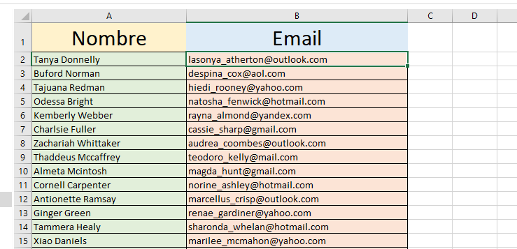
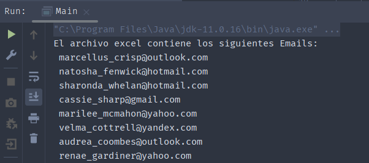

# Lectura desde un archivo de Excel
Cómo obtener datos desde un fichero en formato Excel
En este caso se trata una sola columna, emails, pero se puede hacer con las que sean
necesaria.

### Resulado

